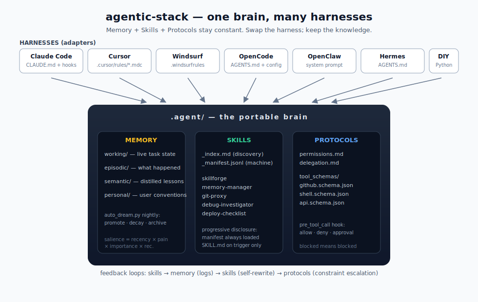

# agentic-stack

**Keep one portable memory-and-skills layer across coding-agent harnesses, so switching tools doesn't reset how your agent works.**

A portable `.agent/` folder (memory + skills + protocols) that plugs into Claude Code, Cursor, Windsurf, OpenCode, OpenClaw, Hermes, Pi Coding Agent, Codex, or a DIY Python loop — and keeps its knowledge when you switch.

<p align="center">
  
</p>

<p align="center">
  
</p>

[](https://github.com/codejunkie99/agentic-stack/releases)
[](LICENSE)
Made by https://x.com/Av1dlive

## Quickstart

### macOS / Linux

```bash
# tap + install (one-time — both lines required)
brew tap codejunkie99/agentic-stack https://github.com/codejunkie99/agentic-stack
brew install agentic-stack

# drop the brain into any project — the onboarding wizard runs automatically
cd your-project
agentic-stack claude-code
# or: cursor | windsurf | opencode | openclaw | hermes | pi | codex | standalone-python | antigravity
```

### Windows (PowerShell)

```powershell
# clone + run the native installer
git clone https://github.com/codejunkie99/agentic-stack.git
cd agentic-stack
.\install.ps1 claude-code C:\path\to\your-project
```

### Already installed?

```bash
brew update && brew upgrade agentic-stack
```

### Clone instead?

```bash
git clone https://github.com/codejunkie99/agentic-stack.git
cd agentic-stack && ./install.sh claude-code         # mac / linux / git-bash
# or on Windows PowerShell: .\install.ps1 claude-code
# adapters: claude-code | cursor | windsurf | opencode | openclaw | hermes | pi | codex | standalone-python | antigravity
```

## Onboarding wizard

After the adapter is installed, a terminal wizard populates
`.agent/memory/personal/PREFERENCES.md` — the **first file your AI reads
at the start of every session** — and writes a feature-toggle file at
`.agent/memory/.features.json`.

Six preference questions (each skippable with Enter):

| Question | Default |
|---|---|
| What should I call you? | *(skip)* |
| Primary language(s)? | `unspecified` |
| Explanation style? | `concise` |
| Test strategy? | `test-after` |
| Commit message style? | `conventional commits` |
| Code review depth? | `critical issues only` |

Plus one **Optional features** step (opt-in, off by default):

| Feature | Default |
|---|---|
| Enable FTS memory search `[BETA]` | `no` |

**Flags:**

```bash
agentic-stack claude-code --yes          # accept all defaults, beta off (CI/scripted)
agentic-stack claude-code --reconfigure  # re-run the wizard on an existing project
```

Edit `.agent/memory/personal/PREFERENCES.md` any time to refine your
conventions, or `.agent/memory/.features.json` to flip feature toggles.

## Review protocol (host-agent CLI)

The nightly `auto_dream.py` cycle only **stages** candidate lessons. It
does not mark anything accepted or modify semantic memory. Your host
agent does the review in-session:

```bash
# list pending candidates, sorted by priority
python3 .agent/tools/list_candidates.py

# accept with rationale (required)
python3 .agent/tools/graduate.py <id> --rationale "evidence holds, matches PREFERENCES"

# reject with reason (required); preserves decision history
python3 .agent/tools/reject.py <id> --reason "too specific to generalize"

# requeue a previously-rejected candidate
python3 .agent/tools/reopen.py <id>
```

Graduated lessons land in `semantic/lessons.jsonl` (source of truth) and
are rendered to `semantic/LESSONS.md`. Rejected candidates retain full
decision history so recurring churn is visible, not fresh.

See [`docs/architecture.md`](docs/architecture.md) for the full lifecycle.

---

## What this is

Every guide shows the folder structure. This repo gives you the folder
structure **plus the files that actually go inside**: a working portable
brain with five seed skills, four memory layers, enforced permissions, a
nightly staging cycle, host-agent review tools, and adapters for multiple
harnesses.

- **Memory** — `working/`, `episodic/`, `semantic/`, `personal/`. Each
  layer has its own retention policy. Query-aware retrieval (salience ×
  relevance); nightly compression into reviewable candidates.
- **Review protocol** — `auto_dream.py` stages candidate lessons
  mechanically. Your host agent reviews them via CLI tools
  (`graduate.py`, `reject.py`, `reopen.py`) and commits decisions with
  a required rationale. No unattended reasoning, no provider coupling.
- **Skills** — progressive disclosure. A lightweight manifest always
  loads; full `SKILL.md` files only load when triggers match the task.
  Every skill ships with a self-rewrite hook.
- **Protocols** — typed tool schemas, a `permissions.md` that the
  pre-tool-call hook enforces, and a delegation contract for sub-agents.

## Releases & changelog

Per-version release notes live in [CHANGELOG.md](CHANGELOG.md). The
latest release, what broke, what's new, upgrade path, all there.

## Memory search `[BETA]`

Opt-in FTS5 keyword search over all memory documents:

```bash
# enable during onboarding (or set manually in .agent/memory/.features.json)
python3 .agent/memory/memory_search.py "deploy failure"
python3 .agent/memory/memory_search.py --status
python3 .agent/memory/memory_search.py --rebuild
```

Falls back to **ripgrep** (`rg`) if installed, then to `grep` — both
restricted to `.md` / `.jsonl` so source files never pollute results.
The index is stored at `.agent/memory/.index/` and gitignored.

## Repo layout

```
.agent/                         # the portable brain (same across harnesses)
├── AGENTS.md                   # the map
├── harness/                    # conductor + hooks (standalone path)
│   └── hooks/
│       ├── claude_code_post_tool.py  # rich PostToolUse logging (v0.8+)
│       ├── pre_tool_call.py    # permissions enforcement
│       ├── post_execution.py   # log_execution() entry point
│       └── on_failure.py       # failure write + repeated-failure rewrite flag
├── memory/                     # working / episodic / semantic / personal
│   ├── auto_dream.py           # staging-only dream cycle
│   ├── cluster.py              # content clustering + pattern extraction
│   ├── promote.py              # stage candidates
│   ├── validate.py             # heuristic prefilter (length + exact duplicate)
│   ├── review_state.py         # candidate lifecycle + decision log
│   ├── render_lessons.py       # lessons.jsonl → LESSONS.md
│   └── memory_search.py        # [BETA] FTS5 search (opt-in)
├── skills/                     # _index.md + _manifest.jsonl + SKILL.md files
├── protocols/                  # permissions + tool schemas + delegation
│   └── hook_patterns.json      # user-owned high/medium-stakes regex (v0.8+)
└── tools/                      # host-agent CLI + memory_reflect + skill_loader
    ├── learn.py                # one-shot lesson teaching (stage + graduate)
    ├── recall.py               # surface lessons relevant to an intent
    ├── show.py                 # colorful brain-state dashboard
    ├── list_candidates.py
    ├── graduate.py
    ├── reject.py
    └── reopen.py

adapters/                       # one small shim per harness
├── claude-code/   (CLAUDE.md + settings.json hooks)
├── cursor/        (.cursor/rules/*.mdc)
├── windsurf/      (.windsurfrules)
├── opencode/      (AGENTS.md + opencode.json)
├── openclaw/      (AGENTS.md + system-prompt include; auto-registers per-project agent)
├── hermes/        (AGENTS.md)
├── pi/            (AGENTS.md + .pi/skills symlink)
├── codex/         (AGENTS.md)
├── standalone-python/  (DIY conductor entrypoint)
└── antigravity/   (ANTIGRAVITY.md)

docs/                           # architecture, getting-started, per-harness
install.sh                      # mac / linux / git-bash installer
install.ps1                     # Windows PowerShell installer
CHANGELOG.md                    # per-version release notes (v0.1.0 onward)
onboard.py                      # onboarding wizard entry point
onboard_features.py             # .features.json read/write
onboard_ui.py                   # ANSI palette, banner, clack-style layout
onboard_widgets.py              # arrow-key prompts (text, select, confirm)
onboard_render.py               # answers → PREFERENCES.md content
onboard_write.py                # atomic file write with backup
test_claude_code_hook.py        # hook validation suite (54 checks)
verify_codex_fixes.py           # v0.8.0 regression checks (33 checks)
```

## Supported harnesses

| Harness | Config file it reads | Hook support |
|---|---|---|
| **Claude Code** | `CLAUDE.md` + `.claude/settings.json` | yes (PostToolUse, Stop) |
| **Cursor** | `.cursor/rules/*.mdc` | no (manual reflect calls) |
| **Windsurf** | `.windsurfrules` | no (manual reflect calls) |
| **OpenCode** | `AGENTS.md` + `opencode.json` | partial (permission rules) |
| **OpenClaw** | `AGENTS.md` (auto-injected) + per-project `openclaw agents add --workspace` | varies by fork |
| **Hermes Agent** | `AGENTS.md` (agentskills.io compatible) | partial (own memory) |
| **Pi Coding Agent** | `AGENTS.md` + `.pi/skills/` + `.pi/extensions/` | yes (`tool_result` event) |
| **Codex** | `AGENTS.md` + `.agents/skills/` | no (manual reflect calls) |
| **Standalone Python** | `run.py` (any LLM) | yes (full control) |
| **Antigravity** | `ANTIGRAVITY.md` | yes (system context) |

## Seed skills

- **skillforge** — creates new skills from recurring patterns
- **memory-manager** — runs reflection cycles, surfaces candidate lessons
- **git-proxy** — all git ops, with safety constraints
- **debug-investigator** — reproduce → isolate → hypothesize → verify
- **deploy-checklist** — the fence between staging and production

## How it compounds

1. Skills log every action to episodic memory.
2. `auto_dream.py` clusters recurring patterns into candidate lessons.
3. The host agent reviews candidates with `graduate.py` / `reject.py`.
4. Graduated lessons append to `lessons.jsonl`; `LESSONS.md` re-renders.
5. Future sessions load query-relevant accepted lessons automatically.
6. `on_failure` flags skills that fail 3+ times in 14 days for rewrite.
7. `git log .agent/memory/` becomes the agent's autobiography.

## Run the staging cycle nightly

```bash
crontab -e
0 3 * * * python3 /path/to/project/.agent/memory/auto_dream.py >> /path/to/project/.agent/memory/dream.log 2>&1
```

`auto_dream.py` resolves its paths absolutely and performs only mechanical
file operations (cluster, stage, prefilter, decay). No git commits, no
network, no reasoning — safe to run unattended.

## License

Apache 2.0 — see [LICENSE](LICENSE).

## Credits

Based on the article **["The Agentic Stack"](https://x.com/Av1dlive/status/2044453102703841645?s=20)**
by [@AV1DLIVE](https://twitter.com/AV1DLIVE) — follow for updates and collabs.
Coded using Minimax-M2.7 in the Claude Code harness; PR review by Macroscope and Codex.
Patterns from Gstack, Claude Code's memory system, and conversations in the
agent-engineering community. Built with the hypothesis that
**harness-agnosticism is the point**.

## Star History

[](https://star-history.com/#codejunkie99/agentic-stack&Date)
