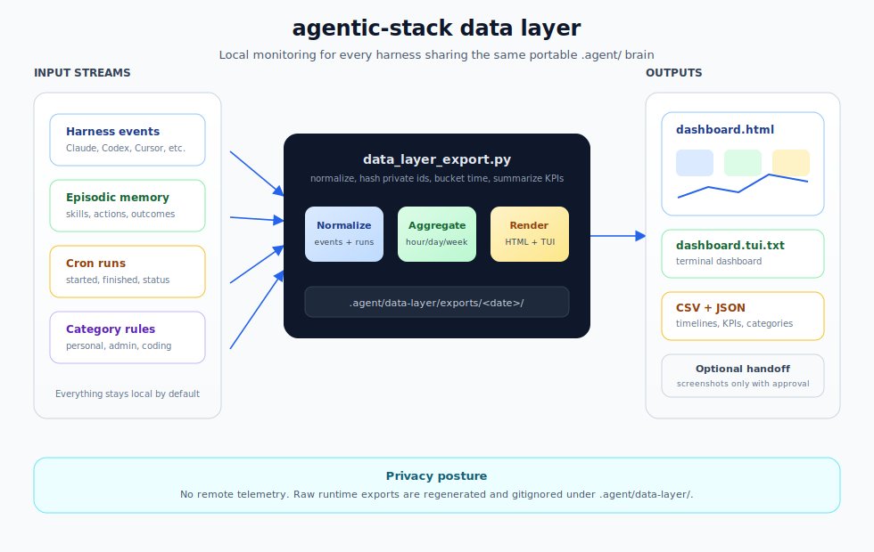

# agentic-stack Data Layer

The data layer gives the portable `.agent/` brain a local dashboard for the
entire suite of agents: Claude Code, Hermes, OpenClaw, Codex, Cursor, OpenCode,
Windsurf, Pi, Antigravity, and custom loops.

<p align="center">
  
</p>

It is a companion to the GStack Data Layer idea, adapted for agentic-stack's
core promise: one shared memory-and-skills layer across many harnesses.

## What It Measures

- agent events by harness
- cron/scheduled runs with start and finish timestamps
- Gantt-ready cron timelines
- active agents
- tokens and estimated cost by hour, day, week, or month
- workflow success and error rates
- KPI summary rows for run volume, cron cadence, reliability, active agents,
  workflow breadth, category usage, token usage, and estimated cost
- user-defined categories such as personal, admin, work, financial, coding, or
  custom categories
- daily screenshot/report targets for resource and project management

## Privacy Model

Local-first by default.

- No network calls.
- No telemetry.
- No hosted dashboard.
- Raw run/profile identifiers are hashed in exports.
- `.agent/data-layer/` is gitignored and should be treated as private runtime
  state.
- Daily screenshots are local artifacts unless the user explicitly approves a
  destination and delivery mechanism.

## Inputs

Default input:

```text
.agent/memory/episodic/AGENT_LEARNINGS.jsonl
```

Optional local inputs:

```text
.agent/data-layer/harness-events.jsonl
.agent/data-layer/cron-runs.jsonl
.agent/data-layer/category-rules.json
```

Use `harness-events.jsonl` for harnesses that do not yet write rich events into
episodic memory. Use `cron-runs.jsonl` for scheduled agents or external crons.

## Export

```bash
python3 .agent/tools/data_layer_export.py --window 30d --bucket day
```

The same exporter accepts simple natural-language requests:

```bash
python3 .agent/tools/data_layer_export.py show me last 7 days by hour
```

The `data-layer` skill is designed to be injected into supported harnesses, so
the model can decide to run the dashboard when users ask things like "show me
the dashboard" or "what did my agents do" instead of asking them to remember
flags. Explicit `--window` and `--bucket` flags still override natural-language
words for scripts.

Time buckets:

- `hour`
- `day`
- `week`
- `month`

Outputs:

```text
.agent/data-layer/exports/<YYYY-MM-DD>/
  agent-events.jsonl
  agent-events.csv
  cron-runs.jsonl
  cron-runs.csv
  cron-timeline.json
  cron-timeline.csv
  activity-series.json
  activity-series.csv
  category-summary.json
  category-summary.csv
  harness-summary.json
  harness-summary.csv
  workflow-summary.json
  workflow-summary.csv
  kpi-summary.json
  kpi-summary.csv
  dashboard-summary.json
  dashboard-report.json
  dashboard.html
  dashboard.tui.txt
  daily-report.md
```

`dashboard.html` is dependency-free and screenshot-ready. It renders resource
overview, activity, token usage, cron frequency, task categories, harness mix,
workflow outcomes, a Gantt-style cron panel, and cron timeline tables.

The same command prints an onboarding-style terminal dashboard after export:

```bash
python3 .agent/tools/data_layer_export.py --window 30d --bucket day
```

This is useful inside coding tools where the agent and user share a terminal.
The same text view is also saved as `dashboard.tui.txt`.

## KPI Coverage

The first exporter focuses on universal agent-operations KPIs that apply across
Claude Code, Hermes, OpenClaw, Codex, and custom loops:

- run volume: agent events, cron runs, events per day, cron runs per day
- resource usage: tokens in, tokens out, total tokens, cost estimate, cost per run
- reliability: successes, errors, success rate, error rate
- throughput: median duration and workflow counts
- utilization: active agents and harness mix
- project-management shape: categories, workflows, and scheduled-work cadence

Vertical business KPIs such as lead response time, offer rate, ticket aging,
invoice collection, or support resolution can be added as sanitized local events
or downstream dashboard columns. The core exporter stays domain-neutral.

## Cron Runs

Cron records should include start and finish timestamps whenever possible:

```json
{
  "id": "cron_daily_followup_001",
  "started_at": "2026-04-25T09:00:00Z",
  "finished_at": "2026-04-25T09:12:00Z",
  "harness": "openclaw",
  "schedule": "0 9 * * *",
  "name": "daily follow-up sweep",
  "workflow": "crm_followup",
  "status": "success",
  "agent_id": "local-only-agent-id",
  "tokens_in_estimate": 2200,
  "tokens_out_estimate": 650,
  "cost_estimate_usd": 0.14,
  "privacy_level": "local_only",
  "pii_level": "none"
}
```

The exporter hashes raw `agent_id` values.

## Categories

Users define their own resource buckets:

```json
{
  "default_category": "uncategorized",
  "rules": [
    {"category": "coding", "skills": ["debug-investigator", "git-proxy"]},
    {"category": "admin", "run_types": ["cron"]},
    {"category": "financial", "workflows": ["invoice_collection"]},
    {"category": "personal", "workflows": ["calendar_coordination"]},
    {"category": "work", "phases": ["plan", "review", "qa", "ship"]}
  ]
}
```

Categories are deliberately user-owned. Agentic-stack should not hard-code what
counts as work, personal, admin, or financial activity.

## Daily Screenshot Reports

A user-approved scheduled agent can:

1. Run `python3 .agent/tools/data_layer_export.py --window 30d --bucket day`.
2. Open `.agent/data-layer/exports/<date>/dashboard.html`.
3. Capture the key panels, especially Resource Overview, KPI Summary, Tokens,
   Cron Runs, Task Categories, Harness Mix, Workflow Outcomes, and Cron Gantt.
4. Send the screenshot and `daily-report.md` through an approved channel.

This PR does not implement delivery. It creates the local artifact that future
email, Slack, webhook, or project-management integrations can use.

## Relationship To GStack

GStack's Data Layer PR focuses on GStack/OpenClaw/Hermes skill runs and business
KPIs. Agentic-stack's data layer focuses one level lower: the portable `.agent/`
brain and every harness that writes to it. The two formats intentionally share
concepts such as agent events, cron runs, activity series, category rollups,
dashboard summaries, and screenshot-ready reports.
